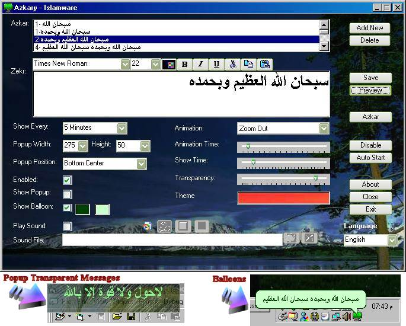



## Azkary \- Customizable Periodic Popups and Balloons Messages \(Updated 3/3/2007\)

### Description

This program designed for displaying Muslims Daily Azkar (GOD Blessings) at customizable preset periodic times. Multi lingual comes with English

and Arabic. Displaying optional Animated Popups with your Azkar or Balloons at the task menu. Popups messages are animated with selectable

background images and the location on screen is configurable at any of nine screen locations corners plus centers. The program also includes all

Muslims daily Azkar and their times and beneifts. The program can auto start with Windows and position itself in the task bar for easy access. Please

let me know if you have done any improvements or have any suggestions. Latest version can always be downloaded from our website

http://www.islamware.com with other code available. Version 1.1 Added Rotate Azkar feature, New Design, Times settings in seconds, bug fix for ballon position.
 
### More Info
 

             |
---                |---
**Submitted On**   |2007-03-03 10:23:56
**By**             |[Ahmed Amin Elsheshtawy](https://github.com/Planet-Source-Code/PSCIndex/blob/master/ByAuthor/ahmed-amin-elsheshtawy.md)
**Level**          |Intermediate
**User Rating**    |4.6 (60 globes from 13 users)
**Compatibility**  |VB 3\.0, VB 4\.0 \(16\-bit\), VB 4\.0 \(32\-bit\), VB 5\.0, VB 6\.0, VB Script
**Category**       |[Complete Applications](https://github.com/Planet-Source-Code/PSCIndex/blob/master/ByCategory/complete-applications__1-27.md)
**World**          |[Visual Basic](https://github.com/Planet-Source-Code/PSCIndex/blob/master/ByWorld/visual-basic.md)
**Archive File**   |[Azkary\_\-\_C205131332007\.zip](https://github.com/Planet-Source-Code/ahmed-amin-elsheshtawy-azkary-customizable-periodic-popups-and-balloons-messages-updated-3__1-67848/archive/master.zip)

